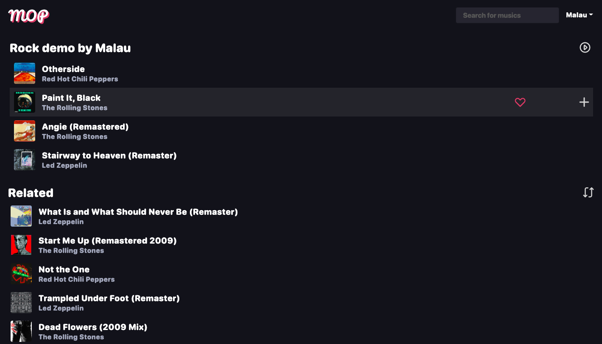

<div align="center">
  <h1>MopRs</h1>
  
  <p>
    An awesome deezer client !
  </p>

<!-- Badges -->
<p>
  <a href="https://github.com/MalauD/MopRs/actions">
    
  </a>
</p>
   
<h4>
    <a href="https://github.com/MalauD/MopRs/issues/">Report Bug</a>
  <span> · </span>
    <a href="https://github.com/MalauD/MopRs/issues/">Request Feature</a>
  </h4>
</div>
<div align="center">

  
</div>
<br />
<!-- About the Project -->

## About the Project

This is deezer client providing multiple features like having multiple users, music trends, related musics, making playlists and much more !

<!-- TechStack -->

### Tech Stack

<details>
  <summary>Client</summary>
  <ul>
    <li><a href="https://reactjs.org//">React</a></li>
    <li><a href="https://getbootstrap.com/">Bootstrap</a></li>
    <li><a href="https://akveo.github.io/eva-icons/">Eva Icon</a></li>
    <li><a href="https://akveo.github.io/react-native-ui-kitten/docs/design-system/eva-dark-theme">UI Kitten Theme</a></li>
  </ul>
</details>

<details>
  <summary>Server</summary>
  <ul>
    <li><a href="https://www.rust-lang.org/fr">Rust</a></li>
    <li><a href="https://actix.rs/">Actix</a></li>
    <li><a href="https://github.com/seanmonstar/reqwest">Reqwest</a></li>
    <li><a href="https://www.mongodb.com/docs/drivers/rust/">MongoDB Rust Driver</a></li>
  </ul>
</details>

<details>
<summary>Database</summary>
  <ul>
    <li><a href="https://www.mongodb.com/">MongoDB</a></li>
    <li><a href="https://min.io/">MinIO</a></li>
  </ul>
</details>

<details>
<summary>DevOps</summary>
  <ul>
    <li><a href="https://www.docker.com/">Docker</a></li>
    <li><a href="https://kubernetes.io/">Kubernetes</a></li>
    <li><a href="https://github.com/features/actions">Github Actions</a></li>
  </ul>
</details>

<!-- Features -->

### Features

-   Creating playlists
-   Suggestion to complete playlists
-   Trending musics

<!-- Env Variables -->

### Environment Variables

To run this project, you will need to add the following environment variables to your .env file

`S3_URL`

`ARL`

`MONGO_URL`

<!-- Getting Started -->

## Getting Started without Kubernetes

<!-- Prerequisites -->

### Prerequisites

You will need the following software:

-   MinIO instance running
-   MongoDB database running
-   Redis server running

### Environment variables description

| Variable                                 | Description                                                              | Default                 |
| ---------------------------------------- | ------------------------------------------------------------------------ | ----------------------- |
| `S3_URL`                                 | Url used to connect to s3                                                |                         |
| `ARL`                                    | Arl token used to download music from deezer                             |                         |
| `MONGO_URL`                              | Url used to connect to mongo database                                    |                         |
| `REDIS_SERVICE_HOST`                     | Address used to connect to redis                                         |                         |
| `REDIS_SERVICE_PORT`                     | Port for redis connection                                                |                         |
| `REDIS_PASSWORD`                         | Password in case redis is secured                                        |                         |
| `REDIS_USERNAME`                         | Username in case redis is secured                                        |                         |
| `SESSION_KEY`                            | Key used for cookie generation                                           | Generated at each start |
| `SESSION_DURATION`                       | Duration of user session (s)                                             | `3600\*24\*7`           |
| `ARTIST_UPDATE_INTERVAL`                 | Specify interval at which an artist top tracks, related.. is updated (s) | `3600`                  |
| `ARTIST_SCRAPE_UPDATE_INTERVAL`          | Same as above but for the scraper (s)                                    | `3600\*24\*3`           |
| `ARTIST_SCRAPE_COOLDOWN`                 | Cooldown used to not overflow deezer api (ms)                            | `100`                   |
| `ARTIST_PERIODIC_SCRAPE_CHECK_INTERVAL`  | Interval at which all artists in db are checked to be updated or not (s) | 60\*30                  |
| `ARTIST_PERIODIC_SCRAPE_UPDATE_INTERVAL` | Same as `ARTIST_UPDATE_INTERVAL` but for periodic scraping (s)           | 3600\*24\*7             |

<!-- Installation -->

### Installation

Transpile MopRs client

```bash
  npm install
  npx webpack --mode production
```

Compile MopRs server

```bash
  cargo build --release
```

Run MopRs server

```bash
  cargo run --release
```

Your app should be available at 8080

## Getting Started with Kubernetes

<!-- Prerequisites -->

### Prerequisites

You will need the following software:

-   Kubernetes
-   MongoDB operator running on Kubernetes

<!-- Installation -->

### Installation

#### Install redis on cluster

First install redis operator using

```bash
helm upgrade redis-operator ot-helm/redis-operator --install --namespace default
```

Then install redis standalone

```bash
helm upgrade redis ot-helm/redis --install --namespace default  -f .kube/redis_values.yaml
```

#### Applying yaml files

You will just need to apply `.yaml` files in `.kube` directory

```bash
  kubectl apply -f .kube
```

Your app should be available at 80

#### Setup cluster monitoring

You can monitor your cluster using grafana & prometheus by doing the following operations

```bash
kubectl create namespace monitoring
helm repo add prometheus-community https://prometheus-community.github.io/helm-charts
helm repo update
helm install prometheus prometheus-community/kube-prometheus-stack --namespace monitoring
```

To access prometheus use

```bash
sudo kubectl port-forward svc/prometheus-kube-prometheus-prometheus -n monitoring 9090
```

and for grafana

```bash
sudo kubectl port-forward svc/prometheus-grafana -n monitoring 3000:80
```

<!-- Contributing -->

## Contributing

<a href="https://github.com/MalauD/MopRs/graphs/contributors">
  
</a>

Contributions are always welcome!

Do not hesitate to start a pull request !

<!-- Code of Conduct -->

### Code of Conduct

Please read the [Code of Conduct](https://github.com/MalauD/MopRs/blob/master/CODE_OF_CONDUCT.md)

<!-- License -->

## License

Distributed under the no License. See [LICENSE](https://github.com/MalauD/MopRs/blob/master/LICENSE) for more information.
